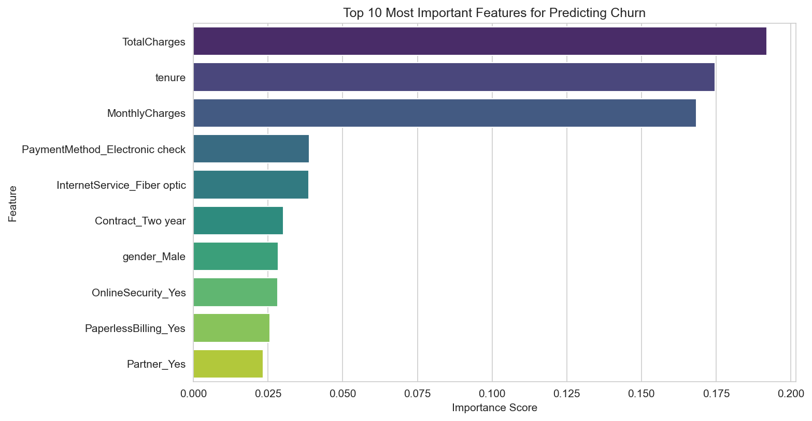

# 📊 Customer Churn Prediction

An end-to-end machine learning project that predicts telecom customer churn and serves the model through an interactive Streamlit web application.


---

## 🎯 Project Overview

Customer churn — when a customer stops using a company's service — is one of the most costly problems for subscription-based businesses. Acquiring a new customer is significantly more expensive than retaining an existing one.

This project builds a machine learning pipeline that:
- Analyzes historical telecom customer data to uncover **why** customers churn
- Trains and compares multiple classification models to **predict** churn risk
- Deploys the best-performing model as an **interactive web app**, allowing anyone to input a customer's details and get an instant churn risk prediction

**Goal:** Enable proactive retention strategies by identifying at-risk customers before they leave.

---

## 🛠️ Tech Stack

| Category | Tools |
|---|---|
| **Language** | Python 3.10 |
| **Data Manipulation** | Pandas, NumPy |
| **Visualization** | Matplotlib, Seaborn |
| **Machine Learning** | Scikit-learn |
| **Model Persistence** | Joblib |
| **Web App / Deployment** | Streamlit |
| **Development Environment** | Jupyter Notebook (VS Code) |

---

## 📁 Dataset

- **Source:** [Telco Customer Churn Dataset](https://www.kaggle.com/datasets/blastchar/telco-customer-churn) (IBM Sample Dataset, via Kaggle)
- **Size:** 7,043 customers, 21 features
- **Target Variable:** `Churn` (Yes/No)
- **Features include:** demographics (gender, senior citizen status), account information (tenure, contract type, payment method), and subscribed services (internet, streaming, tech support, etc.)

---

## 🔍 Key Insights from Exploratory Data Analysis

| Insight | Business Implication |
|---|---|
| **Month-to-month contracts churn far more** than 1-year/2-year contracts | Incentivize longer-term contracts with discounts |
| **Churn is concentrated in the first 10 months** of tenure | Focus retention efforts on new customers |
| **Higher monthly charges ($70–100) correlate with higher churn** | Review pricing/value perception for premium tiers |
| **`TotalCharges`, `tenure`, and `MonthlyCharges`** are the top 3 predictive features (~54% combined importance) | Billing and loyalty history are the strongest churn signals |
| Fiber optic internet users and electronic check payers show elevated churn | Investigate service quality and payment friction for these segments |



---

## 🧹 Data Preprocessing

- Identified and fixed a hidden data quality issue: `TotalCharges` contained blank strings (`" "`) instead of proper `NaN` values, causing it to be misread as text. Converted to numeric and imputed missing values using the median.
- Encoded all categorical variables using one-hot encoding (`pd.get_dummies`, `drop_first=True`)
- Scaled numerical features using `StandardScaler` for models sensitive to feature magnitude
- Addressed class imbalance (~73.5% No / ~26.5% Yes) using `class_weight='balanced'`

---

## 🤖 Model Performance

Three models were trained and evaluated on a held-out 20% test set:

| Model | Accuracy | Precision (Churn) | Recall (Churn) | F1-Score (Churn) |
|---|---|---|---|---|
| Logistic Regression | 80.7% | 0.66 | 0.57 | 0.61 |
| Random Forest | 78.6% | 0.62 | 0.49 | 0.55 |
| **Logistic Regression (Class-Balanced)** ⭐ | 73.9% | 0.51 | **0.78** | 0.61 |

### Why the Balanced Model Was Selected

Although the balanced model has lower raw accuracy, it identifies **78% of actual churners** compared to just 57% for the standard model. In a real business context, **failing to identify a customer who is about to churn is far more costly** than occasionally flagging a loyal customer as at-risk (which typically just results in an unnecessary — but harmless — retention offer). This is a deliberate precision/recall trade-off aligned with the business objective.

---

## 💡 Business Recommendations

1. **Target new customers** (first 10 months) with proactive check-ins and onboarding support
2. **Incentivize contract upgrades** — offer discounts for switching from month-to-month to annual contracts
3. **Review pricing for high-paying customers** to ensure perceived value matches cost
4. **Investigate fiber optic service quality** and friction in the electronic check payment flow

---

## 🚀 How to Run This Project

### Option 1: Run the Jupyter Notebook (Full Analysis)

```bash
# Clone the repository
git clone https://github.com/mariaanwar400/Telco-Customer-Churn-Prediction.git
cd Telco-Customer-Churn-Prediction

# Install dependencies
pip install -r requirements.txt

# Open the notebook
jupyter notebook churn_analysis.ipynb
```

### Option 2: Run the Streamlit Web App

```bash
# Clone the repository (if not already done)
git clone https://github.com/mariaanwar400/Telco-Customer-Churn-Prediction.git
cd Telco-Customer-Churn-Prediction

# Install dependencies
pip install -r requirements.txt

# Launch the app
streamlit run app.py
```

The app will open automatically in your browser at `http://localhost:8501`.

---

## 📂 Project Structure

```
Telco-Customer-Churn-Prediction/
├── churn_analysis.ipynb           # Full data analysis & model training notebook
├── app.py                         # Streamlit web application
├── WA_Fn-UseC_-Telco-Customer-Churn.csv   # Dataset
├── churn_prediction_model.pkl     # Saved trained model
├── scaler.pkl                     # Saved feature scaler
├── requirements.txt               # Project dependencies
├── images/
│   └── feature_importance.png     # Saved chart for README
└── README.md
```

---

## 🔮 Future Improvements

- [ ] Hyperparameter tuning with `GridSearchCV` / `RandomizedSearchCV`
- [ ] Experiment with gradient boosting models (XGBoost, LightGBM)
- [ ] Add SHAP values for individual-prediction explainability
- [ ] Deploy the Streamlit app publicly via Streamlit Community Cloud
- [ ] Add automated unit tests for the preprocessing pipeline

---

## 👤 Author

**Maria Anwar**
[LinkedIn](https://www.linkedin.com/in/maria-anwar88/) | [GitHub](https://github.com/mariaanwar400)

---

## 📄 License

This project is open source and available under the [MIT License](LICENSE).
